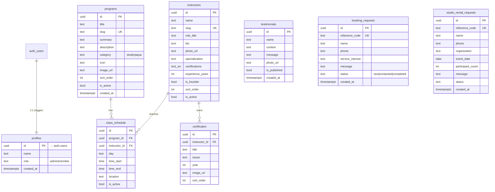

# Sanggar Senam Danie — Architecture & Implementation Plan

Version 1.0 · Next.js 15 (App Router) · TypeScript · Tailwind v4 · shadcn/ui (Base UI) · Supabase

---

## 1. Information Architecture

```
/                     Landing (AIDA funnel)
├─ /about             Tentang Danie — story, credentials, IOSKI role
├─ /program           All programs + weekly schedule
│   └─ /program/[slug]  Program detail (SEO landing: "zumba depok", "yoga depok", …)
├─ /instructor        Instructor team
├─ /sertifikat        Certificate gallery
├─ /contact           Trial class booking form + WhatsApp + map
├─ /rental            Studio rental info + inquiry form
├─ /cek-status        Check booking / rental status by reference code + phone
└─ /admin             (Supabase Auth, role = admin)
    ├─ /admin/login
    ├─ /admin                   Dashboard (new requests, counts)
    ├─ /admin/bookings          Trial requests inbox (status: new → contacted → completed)
    ├─ /admin/rentals           Rental requests inbox
    ├─ /admin/programs          CRUD
    ├─ /admin/schedules         CRUD
    ├─ /admin/instructors       CRUD
    ├─ /admin/certificates      CRUD
    └─ /admin/testimonials      CRUD (publish toggle)
```

Primary nav: Home · Tentang Danie · Program · Instruktur · Sertifikat · Kontak — CTA "Daftar Trial".
Footer adds: Sewa Studio, Cek Status, WhatsApp, address.

### Landing page — AIDA mapping

| Stage     | Section                                   | Visitor goal (time budget)            |
|-----------|-------------------------------------------|---------------------------------------|
| Attention | Hero (headline, Danie photo, 2 CTAs)      | 1s — understand what this is          |
| Attention | Floating cards: quick-trial form + credentials | 10s — trust Danie                |
| Interest  | About Danie + Stats                       | 10s — founder credibility             |
| Interest  | Programs                                  | 30s — know available classes          |
| Desire    | Certificates carousel, Instructors        | proof                                  |
| Desire    | Studio rental, Testimonials               | community & secondary offer           |
| Action    | Location + Final CTA + WhatsApp float     | 60s — ready to register               |

## 2. Database ERD



Deviations from the brief (all additive):
- `studio_rental_requests.phone` — without it the studio cannot reply.
- `reference_code` on both request tables + `get_request_status()` RPC — satisfies "show booking status" without exposing the table to the public.
- `is_active` / `is_published` / `sort_order` — CMS control over what shows and in which order.
- `testimonials.is_published` defaults to `false` — nothing appears publicly until an admin approves it.

### Row Level Security

| Table                  | anon / authenticated         | admin (`is_admin()`) |
|------------------------|------------------------------|----------------------|
| programs, instructors, class_schedule | SELECT where `is_active` | ALL |
| certificates           | SELECT                       | ALL                  |
| testimonials           | SELECT where `is_published`  | ALL                  |
| booking_requests, studio_rental_requests | INSERT only (status must be `new`) | ALL |
| profiles               | SELECT own row               | ALL                  |

`is_admin()` is a `security definer` function reading `profiles.role`. Status lookups go through the `get_request_status(ref, phone)` RPC, which needs both the reference code and the phone number.

### Storage
Public-read buckets `images`, `certificates`, `founder`; only admins can write, update or delete.

## 3. Component Hierarchy (Atomic Design)

```
components/
  ui/          shadcn primitives (restyled via tokens — pill buttons, 24px cards)
  atoms/       Button/ButtonLink, Heading/Text/Eyebrow, Badge, Input, Avatar, Icon, Container, Logo
  molecules/   ProgramCard, InstructorCard, CertificateCard, TestimonialCard, StatsCard,
               SectionHeader, FeatureItem, CheckItem, FormField
  organisms/   Navbar (+MobileNav Sheet), Footer, BookingForm, QuickTrialForm, RentalForm,
               StatusCheckForm, CertificateCarousel, ScheduleTabs, WhatsAppFloat
  sections/    HeroSection, TrustCards, AboutSection, StatsSection, ProgramSection,
               CertificateSection, InstructorSection, RentalSection, TestimonialSection,
               LocationSection, CtaSection
```

Rule: sections compose organisms and molecules and take their data as props. Pages (server components) fetch data and pass it down.

## 4. Design Tokens

| Token              | Value      | Use |
|--------------------|------------|-----|
| brand-500          | `#8B5CF6`  | Decorative purple: hero panel, icon discs, accents, large text |
| brand-700 (primary)| `#6D28D9`  | Buttons, links, focus ring — 7.1:1 on white (AA) |
| brand-800          | `#5B21B6`  | Hover / pressed |
| brand-100 (soft)   | `#EDE9FE`  | Soft purple surfaces, badges |
| surface-soft       | `#FAF9FF`  | Alternating section background |
| ink                | `#171717`  | Primary text |
| ink-muted          | `#666666`  | Secondary text — 5.7:1 on white |
| whatsapp           | `#15803D`  | WhatsApp CTA only (AA with white text) |

> `#8B5CF6` with white text is only 4.2:1, which fails WCAG AA for body-size text. It is therefore used for decoration and large type; interactive fills use `#6D28D9`.

- Font: Plus Jakarta Sans (next/font, self-hosted).
- Type scale: H1 36px mobile → 56px desktop · H2 30px mobile → 42px desktop · body 16px · small 14px.
- Layout: container 1200px; section padding 64px mobile / 100px desktop.
- Shape: card radius 24px, button radius 999px, shadow `0 20px 40px rgba(0,0,0,0.05)`.
- Motion: short fades and rises only (≤ 400ms), with `prefers-reduced-motion` respected.

## 5. Folder Structure

```
src/
  app/
    (site)/            public pages + shared layout (Navbar, Footer, WhatsApp float)
    admin/             login + (dashboard) route group
    layout.tsx  sitemap.ts  robots.ts  opengraph-image.tsx  not-found.tsx
  components/ ui/ atoms/ molecules/ organisms/ sections/
  features/
    programs/ instructors/ certificates/ testimonials/ schedule/   → queries.ts
    bookings/ rentals/                                             → schema.ts, actions.ts
    admin/                                                         → resources registry, CRUD actions
  lib/
    supabase/   env.ts, public.ts (cookie-less, cacheable), server.ts (session), middleware.ts
    utils/      whatsapp.ts, reference.ts, format.ts
    content/    site.ts (brand facts), fallback.ts (used when Supabase isn't configured)
    seo/        jsonld.ts
  types/        database.ts
  hooks/
supabase/
  migrations/0001_init.sql   seed.sql
```

## 6. Implementation Plan

1. Tokens, font, and restyled shadcn primitives.
2. Supabase schema, RLS, storage, and seed data; typed data layer with static fallback content.
3. Atoms → molecules → organisms → sections.
4. Public pages, SEO (metadata, Open Graph, JSON-LD, sitemap).
5. Booking, rental, and status flows (server actions + zod + honeypot).
6. Admin: auth middleware, dashboard, request inboxes, and config-driven CRUD with image upload.
7. Audits (Nielsen, AIDA, accessibility, SEO, code quality), then fixes; `next build` and lint must pass.
